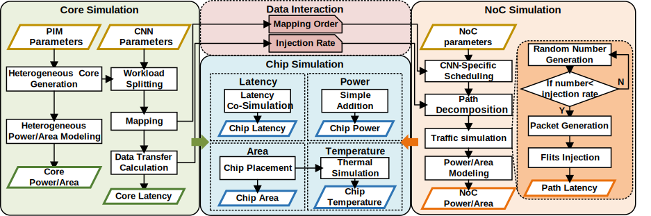
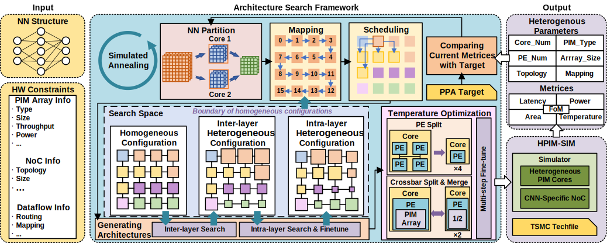
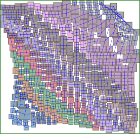
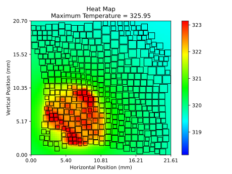
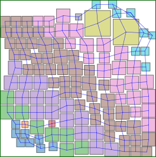
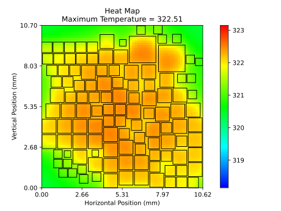

# HPIM-NoC V2.0

HPIM-NoC 是一个集成了 **Booksim2** (NoC 仿真)、**HotSpot** (热仿真) 和 **MNSIM3.0** (存算一体仿真) 的异构存算 NoC 仿真平台。

## 目录结构简介

*   **booksim2**: NoC 互连网络仿真器（C++）
*   **HotSpot**: 芯片热模型仿真器（C）
*   **MNSIM3.0**: 存算一体行为级仿真器（Python，核心逻辑）

---

## 框架介绍 (Framework Overview)

HPIM-NoC 包含两个核心功能：**性能仿真**与**架构搜索**。

### 1. 仿真框架 (Simulation Framework)
仿真部分负责根据输入的网络模型和硬件配置，协同调用 MNSIM（计算）、Booksim2（通信）和 HotSpot（热学）进行多物理场评估。



### 2. 搜索框架 (Search Framework)
搜索部分基于模拟退火算法 (Simulated Annealing)，在巨大的设计空间中自动探索最优的异构 Tile 配比与 NoC 映射方案。



---

## 快速开始 (Getting Started)

在运行任何仿真或搜索之前，必须先编译底层的 C/C++ 模拟器。

### 1. 编译依赖 (Compilation)

请在项目根目录 `HPIM-NoC` 下依次执行：

```bash
# 1. 编译 Booksim2
cd booksim2/src
make

# 2. 编译 HotSpot
cd ../../HotSpot
make
```

### 2. 进入工作目录

所有的仿真与搜索脚本均位于 `MNSIM3.0` 目录下：

```bash
# 从 HPIM-NoC 根目录进入
cd ../MNSIM3.0
```

---

## 第一部分：性能仿真 (Simulation)

该部分用于评估特定硬件配置和网络架构下的系统性能（延迟、能耗、温度等）。

### 1. 运行仿真

运行默认的仿真主程序：

```bash
python main.py
```

如果您需要针对特定的神经网络模型运行仿真，可以使用以下脚本：

*   **CIFAR-10 / ResNet18**: `python Simulator_cifar10_resnet18.py`
*   **CIFAR-10 / AlexNet**: `python Simulator_cifar10_alexnet.py`
*(注：文件名中包含 `noNoC` 的脚本表示不启用 NoC 仿真的版本)*

### 2. 仿真配置

*   **`SimConfig.ini`**: 核心硬件参数配置。
    *   `Booksim_Flag = 1`: 设置为 1 启用 NoC 仿真，0 则关闭。
    *   `Floorplan_en = 1`: 设置为 1 启用布局和热仿真，0 则关闭。
*   **`mix_tileinfo.ini`**: 异构 Tile 配置文件。
    *   定义Tile的数量。
    *   定义每个 Tile 的类型（NVM 或 SRAM）、Tile尺寸。
    *   定义Tile的拓扑以及负载的映射位置。
*   **`../booksim2/runfiles/nnmeshconfig`**: Booksim2 网络配置文件。
    *   `sample_period`: 采样周期，可调整仿真时长。

### 3. 仿真结果示例 (Examples)

#### 1. ResNet18
| **布局输出 (Layout)** | **热图 (Heatmap)** |
| :---: | :---: |
|  |  |

#### 2. AlexNet
| **布局输出 (Layout)** | **热图 (Heatmap)** |
| :---: | :---: |
|  |  |

---

## 第二部分：架构搜索 (Search)

该部分利用搜索算法（如模拟退火 SA）在设计空间中寻找最优的硬件配置和映射方案。

### 1. 运行搜索

运行基于模拟退火算法的搜索框架：

```bash
python SA.py
```

可以根据实际优化需求对脚本进行修改，针对特定目标或模型的搜索脚本示例：

*   **针对 EDP (Energy-Delay Product) 优化**: `python SA_edp.py`
*   **针对特定模型**: `python SA_cifar10_resnet18_111.py` 等

### 2. 搜索输出

* **配置文件生成**: 搜索过程会生成一系列新的硬件配置文件（命名格式为 `mix_tileinfo_*.ini`，例如 `mix_tileinfo_edp_cifar10_alexnet.ini`）。这些文件记录了搜索到的最优或中间状态的异构 Tile 配比与映射方案，可以直接作为“第一部分：性能仿真”的输入文件进行详细验证。
* **实时日志记录**: 搜索过程中的关键指标会实时记录在对应的文本文件中。例如，运行 `python ./SA_edp.py` 时，`SA_edp.txt` 将会实时更新，记录每一次迭代的架构配置参数及其对应的评估指标（能耗、延迟、EDP 等），便于追踪搜索收敛过程。

### 3. 搜索结果示例

HPIM-NoC在不同神经网络上的搜索结果如下表所示：

<table>
    <tr>
        <th align="center">Neural Network</th>
        <th align="center">Search Config</th>
        <th align="center">Topology</th>
        <th align="center">Core_Num</th>
        <th align="center">Area (mm²)</th>
        <th align="center">Power (W)</th>
        <th align="center">Latency (ms)</th>
        <th align="center">Time (s)</th>
    </tr>
    <tr>
        <td align="center" rowspan="3"><strong>AlexNet</strong></td>
        <td align="center">(α=0, β=0, γ=1)</td>
        <td align="center">CMesh</td>
        <td align="center">16×16</td>
        <td align="center">216.55</td>
        <td align="center">28.65</td>
        <td align="center">0.23</td>
        <td align="center">3211</td>
    </tr>
    <tr>
        <td align="center">(α=0, β=1, γ=1)</td>
        <td align="center">CMesh</td>
        <td align="center">12×12</td>
        <td align="center">127.77</td>
        <td align="center">15.59</td>
        <td align="center">0.25</td>
        <td align="center">2605</td>
    </tr>
    <tr>
        <td align="center">(α=1, β=1, γ=1)</td>
        <td align="center">CMesh</td>
        <td align="center">12×12</td>
        <td align="center">113.73</td>
        <td align="center">12.53</td>
        <td align="center">0.30</td>
        <td align="center">2659</td>
    </tr>
    <tr>
        <td align="center" rowspan="3"><strong>VGG-8</strong></td>
        <td align="center">(α=0, β=0, γ=1)</td>
        <td align="center">CMesh</td>
        <td align="center">16×16</td>
        <td align="center">284.22</td>
        <td align="center">49.40</td>
        <td align="center">1.56</td>
        <td align="center">4399</td>
    </tr>
    <tr>
        <td align="center">(α=0, β=1, γ=1)</td>
        <td align="center">CMesh</td>
        <td align="center">16×16</td>
        <td align="center">310.67</td>
        <td align="center">26.61</td>
        <td align="center">1.51</td>
        <td align="center">4048</td>
    </tr>
    <tr>
        <td align="center">(α=1, β=1, γ=1)</td>
        <td align="center">CMesh</td>
        <td align="center">16×16</td>
        <td align="center">212.20</td>
        <td align="center">27.53</td>
        <td align="center">1.53</td>
        <td align="center">3938</td>
    </tr>
    <tr>
        <td align="center" rowspan="3"><strong>ResNet-18</strong></td>
        <td align="center">(α=0, β=0, γ=1)</td>
        <td align="center">CMesh</td>
        <td align="center">22×22</td>
        <td align="center">540.74</td>
        <td align="center">82.78</td>
        <td align="center">0.88</td>
        <td align="center">5886</td>
    </tr>
    <tr>
        <td align="center">(α=0, β=1, γ=1)</td>
        <td align="center">CMesh</td>
        <td align="center">26×26</td>
        <td align="center">487.86</td>
        <td align="center">59.43</td>
        <td align="center">0.94</td>
        <td align="center">7258</td>
    </tr>
    <tr>
        <td align="center">(α=1, β=1, γ=1)</td>
        <td align="center">CMesh</td>
        <td align="center">24×24</td>
        <td align="center">464.20</td>
        <td align="center">57.44</td>
        <td align="center">0.94</td>
        <td align="center">6333</td>
    </tr>
    <tr>
        <td align="center" rowspan="3"><strong>BERT-Tiny</strong></td>
        <td align="center">(α=0, β=0, γ=1)</td>
        <td align="center">CMesh</td>
        <td align="center">16×16</td>
        <td align="center">246.41</td>
        <td align="center">24.07</td>
        <td align="center">10.79</td>
        <td align="center">2686</td>
    </tr>
    <tr>
        <td align="center">(α=0, β=1, γ=1)</td>
        <td align="center">CMesh</td>
        <td align="center">20×20</td>
        <td align="center">136.18</td>
        <td align="center">6.11</td>
        <td align="center">10.33</td>
        <td align="center">3403</td>
    </tr>
    <tr>
        <td align="center">(α=1, β=1, γ=1)</td>
        <td align="center">CMesh</td>
        <td align="center">14×14</td>
        <td align="center">110.24</td>
        <td align="center">5.84</td>
        <td align="center">10.41</td>
        <td align="center">2513</td>
    </tr>
    <tr>
        <td align="center" rowspan="3"><strong>BERT-Mini</strong></td>
        <td align="center">(α=0, β=0, γ=1)</td>
        <td align="center">CMesh</td>
        <td align="center">30×30</td>
        <td align="center">653.88</td>
        <td align="center">65.43</td>
        <td align="center">41.93</td>
        <td align="center">5865</td>
    </tr>
    <tr>
        <td align="center">(α=0, β=1, γ=1)</td>
        <td align="center">CMesh</td>
        <td align="center">32×32</td>
        <td align="center">423.10</td>
        <td align="center">30.45</td>
        <td align="center">45.38</td>
        <td align="center">6447</td>
    </tr>
    <tr>
        <td align="center">(α=1, β=1, γ=1)</td>
        <td align="center">CMesh</td>
        <td align="center">32×32</td>
        <td align="center">381.06</td>
        <td align="center">30.66</td>
        <td align="center">46.95</td>
        <td align="center">6134</td>
    </tr>
</table>

---


## 常见问题 (Troubleshooting)

*   **编译错误**: 请确保已安装 `g++`, `make` 等基础构建工具。
*   **路径问题**: 运行 Python 脚本时，请确保当前工作目录是 `MNSIM3.0`，否则可能会找不到 `booksim2` 或 `HotSpot` 的可执行文件。
